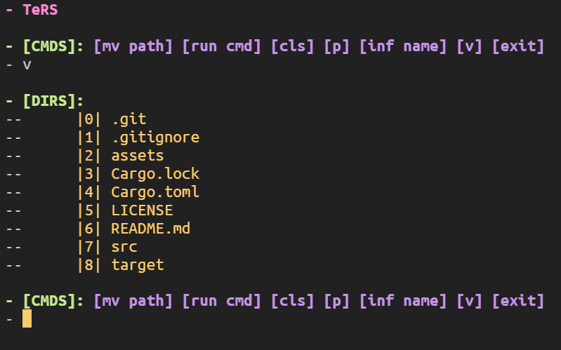

# TeyRS (tay-rs)

**TeyRS** is a terminal-based file explorer and command execution tool written in Rust. It provides a colorful and interactive interface for navigating directories, executing shell commands, and viewing file metadata.



## Features

- **Directory Navigation**: Move between directories and view their contents.
- **Command Execution**: Run shell commands and see their output.
- **File Metadata**: View detailed information about files and directories.
- **Colorful Terminal Output**: Enhance readability with styled and colorized terminal output.
- **Clear Terminal**: Reset the terminal for a fresh view.

## Installation

1. Ensure you have Rust installed. You can install Rust using [rustup](https://rustup.rs/).
2. Clone this repository:

   ```sh
   git clone https://github.com/jawadr9899/teyrs.git
   ```

3. Navigate to the project directory:

   ```sh
   cd teyrs
   ```

4. Build the project:

   ```sh
   cargo build --release
   ```

5. Run the executable:

   ```sh
   ./target/release/teyrs
   ```

## Usage

After running the application, you will be presented with a command menu. You can use the following commands:

- **`mv path`**: Move to the specified directory path.
- **`run cmd`**: Execute the specified shell command.
- **`cls`**: Clear the terminal screen.
- **`p`**: Print the current working directory path.
- **`inf name`**: Show detailed information about the specified file or directory.
- **`v`**: View the contents of the current directory.
- **`exit`**: Exit the application.

### Example

To move to a directory named `documents` and list its contents, you would enter:

```sh
mv documents
```
